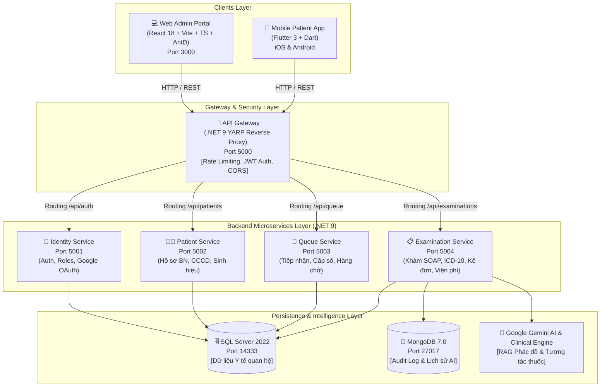

# 🏥 Hospital AI System - Bệnh viện Đa khoa Quốc tế D-Medical
> **Hệ thống Quản lý Quá trình Khám chữa bệnh & Hồ sơ Bệnh án Điện tử (EMR) Tích hợp Trí tuệ Nhân tạo (Clinical AI)**

[](https://dotnet.microsoft.com/)
[](https://react.dev/)
[](https://flutter.dev/)
[](https://www.docker.com/)
[](https://www.microsoft.com/sql-server)
[](https://www.mongodb.com/)
[](https://deepmind.google/technologies/gemini/)
[](#-kiến-trúc-hệ-thống-microservices)
[](LICENSE)

---

## 📌 Giới thiệu Đề tài

**Hospital AI System** là giải pháp chuyển đổi số toàn diện cho Bệnh viện Đa khoa Quốc tế D-Medical, giải quyết trọn vẹn chu trình khám chữa bệnh từ khâu tiếp đón, phân luồng hàng chờ tự động, khám bệnh theo chuẩn lâm sàng quốc tế SOAP, kê đơn thuốc điện tử, quản lý hồ sơ bệnh án EMR trọn đời, đến thanh toán viện phí trực tuyến và hỗ trợ ra quyết định lâm sàng bằng Trí tuệ nhân tạo (Clinical AI).

### 🎯 Mục tiêu cốt lõi:
1. **Xóa bỏ ùn tắc & Tối ưu hàng chờ:** Bệnh nhân bốc số trực tuyến hoặc tại quầy kiosk, theo dõi số thứ tự thời gian thực qua điện thoại di động, giảm 70% thời gian chờ đợi.
2. **Chuẩn hóa quy trình Khám bệnh SOAP & ICD-10:** Hỗ trợ bác sĩ thăm khám theo chuẩn **SOAP** (*Subjective, Objective, Assessment, Plan*), tự động gợi ý mã bệnh theo danh mục ICD-10 của Bộ Y tế.
3. **Bệnh án Điện tử (EMR) Không Giấy tờ:** Lưu trữ lịch sử khám, đơn thuốc, kết quả cận lâm sàng (X-Quang, xét nghiệm), tra cứu tức thì, tuân thủ tiêu chuẩn an toàn dữ liệu y tế PII/HIPAA.
4. **Trợ lý Y tế AI Lâm sàng:** Ứng dụng mô hình ngôn ngữ lớn **Google Gemini Pro / Flash** kết hợp **Bộ máy chẩn đoán offline (Clinical Decision Rule Engine)** hỗ trợ tra cứu phác đồ điều trị, đối chiếu dược thư quốc gia và cảnh báo tương tác thuốc nguy hiểm.
5. **Thanh toán Viện phí Đa kênh:** Hỗ trợ tạo mã thanh toán tự động qua **VietQR, VNPAY, MoMo**, tự động tính toán trừ giảm bảo hiểm y tế (BHYT) đúng chính sách 80%.

---

## 🏗️ Kiến trúc Hệ thống (Microservices Architecture)

Hệ thống được thiết kế theo **Kiến trúc Microservices** hiện đại, đóng gói và vận hành qua **Docker Desktop & Docker Compose** gồm 7 containers độc lập:



---

## 🎨 Bảng Màu Chuẩn Y Tế Số (Strict Medical Palette)

Giao diện Web Admin và Mobile Flutter được đồng bộ 100% theo phong cách **Modern Digital Health UI**:

| Token Name | Mã Màu | Ý Nghĩa / Mục Đích Sử Dụng |
| :--- | :---: | :--- |
| **Primary Color** | `#0284c7` | Nút bấm chính, liên kết, trạng thái active, accent |
| **Primary Dark** | `#0369a1` | Tiêu đề lớn, header thanh điều hướng, điểm nhấn chính |
| **Background Gradient** | `linear-gradient(135deg, #e0f2fe 0%, #f0f9ff 50%, #e2e8f0 100%)` | Nền trang tổng quan, nền auth portal sang trọng |
| **Background Soft Light** | `#f0f9ff` | Nền trang nội dung, table header, khu vực đọc tài liệu |
| **Card Background** | `#ffffff` | Nền thẻ nghiệp vụ (Pure White) |
| **Border Color** | `#bae6fd` | Viền các input, đường phân cách thẻ y tế |
| **Text Main / Headings** | `#0f172a` | Tiêu đề bài viết, chẩn đoán, họ tên bác sĩ/bệnh nhân |
| **Text Sub-label** | `#334155` | Nhãn form, sinh hiệu, đơn vị đo lường |
| **Text Muted** | `#64748b` | Thời gian, ghi chú phụ, số lượt chờ |
| **Box Shadow** | `0 10px 30px rgba(2, 132, 199, 0.1)` | Hiệu ứng nổi khối nhẹ nhàng, tạo chiều sâu y tế |

---

## 🌟 Chi tiết Tính năng & Phân hệ Nghiệp vụ

### 1. 💻 Web Admin Portal (Bác sĩ, Lễ tân & Quản trị)
Xây dựng trên nền tảng **React 18, Vite, TypeScript, Ant Design 5, Tailwind CSS, Recharts**:

- 📊 **Dashboard Tổng quan Y tế:** Biểu đồ tương tác thời gian thực theo dõi tổng lượt khám, doanh thu ngày/tháng, tỷ lệ phân bổ các khoa, sơ đồ trực quan 12 khoa phòng.
- 🎟️ **Tiếp nhận & Cấp số Tự động (Reception):** 
  - Tra cứu thông tin bệnh nhân nhanh theo CCCD hoặc Mã BN.
  - Phân luồng bốc số vào đúng khoa chuyên môn (Nội, Ngoại, Sản, Nhi, Mắt, TMH, RHM, Tim Mạch...).
  - In phiếu số thứ tự có mã QR tra cứu hàng chờ.
- 🩺 **Phòng khám Bệnh án SOAP (Examinations):**
  - **S (Subjective):** Lý do khám, triệu chứng khởi phát, bệnh sử lâm sàng.
  - **O (Objective):** Nhập chỉ số sinh hiệu (Huyết áp, Nhịp tim, Thân nhiệt, SpO2, Cân nặng, Chiều cao, BMI) kèm cảnh báo nguy cơ.
  - **A (Assessment):** Gợi ý mã bệnh quốc tế ICD-10 thông minh từ mô tả triệu chứng.
  - **P (Plan):** Lập kế hoạch điều trị, chỉ định cận lâm sàng (X-Quang, siêu âm, xét nghiệm máu), kê đơn thuốc điện tử.
- 💊 **Kê đơn Thuốc Điện tử & Cảnh báo Tương tác:**
  - Tra cứu kho dược phẩm chuẩn (hàm lượng, đơn vị, liều dùng theo ngày/lần).
  - Cảnh báo chống chỉ định và tương tác thuốc nguy cơ cao.
- 📁 **Hồ sơ Bệnh án Điện tử (EMR):**
  - Tra cứu hồ sơ trọn đời của bệnh nhân qua từng lần tái khám.
  - Xem kết quả chẩn đoán hình ảnh, xét nghiệm đính kèm, tóm tắt bệnh án xuất file PDF.
- 📅 **Quản lý Lịch hẹn Trực tuyến (Appointments):**
  - Tiếp nhận và duyệt các yêu cầu đăng ký khám từ Mobile App.
  - Điều phối lịch trực của bác sĩ, nhắc lịch tự động.
- 💳 **Quản lý Viện phí & Hóa đơn Điện tử (Billing):**
  - Tự động cộng gộp tiền khám, tiền thuốc, dịch vụ cận lâm sàng.
  - Áp dụng trừ giảm quyền lợi BHYT tự động (80%).
  - Tạo mã thanh toán VietQR động kèm thông tin chuyển khoản chính xác.
- 🤖 **Trợ lý AI Y tế Lâm sàng (Clinical AI Assistant):**
  - Khung chat y tế chuyên sâu hỗ trợ bác sĩ tra cứu phác đồ điều trị Bộ Y tế.
  - Phân tích tương tác giữa nhiều hoạt chất thuốc đồng thời.
  - Cơ chế Cascade Failover: Gemini 1.5 Pro -> Gemini 1.5 Flash -> Offline Clinical Decision Engine.
- 🏢 **Danh mục Khoa phòng & Bác sĩ (Catalogs):**
  - Quản lý danh mục 12 khoa chuyên khoa và danh sách hơn 20 bác sĩ chuyên khoa thật.
- 🛡️ **Nhật ký Hệ thống & Bảo mật (Audit Log & Security):**
  - Ghi nhận mọi thao tác xem, sửa đổi hồ sơ bệnh án theo tiêu chuẩn bảo mật y tế HIPAA.

---

### 2. 📱 Mobile Patient App (Ứng dụng Bệnh nhân - Flutter)
Xây dựng trên nền tảng **Flutter 3, Dart, Provider State Management, Dio HTTP Client**:

- 🚀 **Onboarding & Khảo sát Thông minh:**
  - Giới thiệu 3 trụ cột y tế số: Đặt khám thông minh, Hồ sơ EMR cá nhân, Trợ lý AI chăm sóc sức khỏe.
  - Khảo sát thông minh: *"Bạn đã từng khám tại D-Medical chưa?"* để tự động phân luồng:
    + Bệnh nhân cũ: Chuyển sang Đăng nhập để đồng bộ EMR theo CCCD/SĐT.
    + Bệnh nhân mới: Chuyển sang Đăng ký để cấp mới mã bệnh nhân.
- 📅 **Đặt lịch Khám bệnh 4.0:**
  - Lựa chọn theo Khoa phòng chuyên khoa hoặc lựa chọn Bác sĩ yêu thích.
  - Chọn ngày khám, khung giờ khám phù hợp, xác nhận thông tin tức thì.
- 🔢 **Theo dõi Hàng chờ Trực tuyến (Queue Tracker):**
  - Hiển thị số thứ tự đang khám hiện tại tại phòng khám.
  - Cảnh báo: *"Còn 2 người nữa tới lượt bạn, xin vui lòng chuẩn bị vào phòng khám"*.
- 📋 **Sổ Bệnh án Điện tử Di động (Mobile EMR):**
  - Lưu trữ toàn bộ lịch sử các đợt khám bệnh.
  - Xem lại đơn thuốc của bác sĩ với hướng dẫn liều dùng Sáng/Trưa/Chiều/Tối rõ ràng.
- 💳 **Thanh toán Viện phí Trực tuyến:**
  - Hiển thị chi tiết bảng kê chi phí: Tiền khám, tiền thuốc, giảm trừ BHYT 80%.
  - Tích hợp quét mã VietQR tự động điền số tiền và nội dung thanh toán.
- 📈 **Theo dõi Chỉ số Sinh hiệu Cá nhân (Health Monitor):**
  - Bệnh nhân tự cập nhật Huyết áp, Nhịp tim, Đường huyết, BMI, SpO2 tại nhà.
  - Biểu đồ trực quan theo dõi sức khỏe kèm khuyến nghị dinh dưỡng/lối sống.
- ⏰ **Nhắc lịch Uống thuốc Thông minh (Medication Reminder):**
  - Tạo lịch nhắc uống thuốc tự động trích xuất trực tiếp từ đơn thuốc EMR.
  - Bật thông báo đẩy (Push Notification) đúng khung giờ, đánh dấu đã uống thuốc.
- 💉 **Sổ Tiêm chủng Điện tử (Vaccine Pass):**
  - Danh mục vắc xin chuẩn (Cúm, Phế cầu, HPV, Viêm gan B...).
  - Quản lý lịch tiêm các mũi đã thực hiện và hẹn lịch mũi tiêm kế tiếp.
- 🆘 **Nút Cấp cứu Khẩn cấp 115:**
  - Quay số khẩn cấp 1-chạm gọi trung tâm cấp cứu 115 và hotline bệnh viện 24/7.

---

## 🗂️ Cấu trúc Thư mục Dự án

```text
Hospital_AI/
│
├── docker-compose.yml              # Điều phối 7 Containers (DB, Gateway, 4 Services, Web Admin)
├── .dockerignore
├── .gitignore
├── LICENSE
├── README.md                       # Tài liệu hướng dẫn toàn diện dự án
│
├── docs/                           # Tài liệu Đề tài Tốt nghiệp & Database Script
│   ├── 15_NguyenThanhDuy.docx      # Quyển Báo cáo Đồ án Tốt nghiệp
│   ├── PROGRESS_REPORT.md          # Báo cáo Tiến độ Đề tài Chi tiết
│   ├── HospitalAI_DB.sql           # Schema SQL Server 2022 hoàn chỉnh
│   ├── SEED_REAL_DOCTORS_DEPARTMENTS.sql # Script dữ liệu mẫu 12 Khoa & 20 Bác sĩ thật
│   ├── DATABASE_DATAGRIP_GUIDE.md  # Hướng dẫn kết nối Database qua DataGrip/DBeaver
│   └── load-testing/               # Kịch bản kiểm thử tải k6 & Locust
│
├── src/
│   ├── backend/                    # Solution Backend .NET 9 Microservices
│   │   ├── HospitalAI.sln
│   │   ├── building-blocks/        # Shared Libraries dùng chung
│   │   │   ├── HospitalAI.Domain/          # Core Domain Entities, Enums, Value Objects
│   │   │   ├── HospitalAI.Application/     # CQRS, DTOs, Interfaces, Business Logic
│   │   │   └── HospitalAI.Infrastructure/  # EF Core, DbContext, JWT, Email, Repositories
│   │   │
│   │   └── services/               # 5 Microservices Độc lập
│   │       ├── HospitalAI.Gateway/             # .NET 9 YARP Reverse Proxy Gateway (Port 5000)
│   │       ├── HospitalAI.IdentityService/     # Xác thực, JWT, Phân quyền (Port 5001)
│   │       ├── HospitalAI.PatientService/      # Quản lý Bệnh nhân & EMR (Port 5002)
│   │       ├── HospitalAI.QueueService/        # Tiếp nhận & Cấp số Hàng chờ (Port 5003)
│   │       └── HospitalAI.ExaminationService/  # Khám SOAP, ICD-10, Kê đơn, Viện phí (Port 5004)
│   │
│   ├── web-admin/                  # Web Portal Bác sĩ / Lễ tân / Admin
│   │   ├── Dockerfile              # Multi-stage build Nginx
│   │   ├── package.json
│   │   ├── vite.config.ts
│   │   └── src/
│   │       ├── components/         # Header, Sidebar, SOAP Form, Modals
│   │       ├── pages/              # 13 Màn hình nghiệp vụ y tế hoàn chỉnh
│   │       ├── services/           # Axios API Client, Gemini AI Service, Auth Service
│   │       └── store/              # Zustand Auth & System State Management
│   │
│   └── mobile-patient/             # Mobile App Bệnh nhân (Flutter)
│       ├── pubspec.yaml
│       └── lib/
│           ├── core/               # Theme y tế số, Constants, Routes, Network API
│           ├── models/             # Patient, Examination, Appointment, Vaccine, Vital models
│           ├── providers/          # Auth, Queue, Appointment, Health providers
│           ├── widgets/            # Card y tế, QR VietQR Generator, Status Tag
│           └── views/              # Onboarding, Booking, Queue, EMR, Payment, Vitals
```

---

## 🚀 Hướng dẫn Cài đặt & Vận hành

### 1. Yêu cầu Môi trường (Prerequisites)
- [Docker Desktop](https://www.docker.com/products/docker-desktop/) (Đã bật WSL2 trên Windows hoặc Docker Engine trên Linux/macOS).
- [.NET 9.0 SDK](https://dotnet.microsoft.com/download/dotnet/9.0) (Nếu muốn phát triển / chạy debug cục bộ).
- [Node.js 18+ & npm](https://nodejs.org/) (Dành cho Web Admin).
- [Flutter 3.x SDK](https://flutter.dev/docs/get-started/install) (Dành cho Mobile App).

---

### 2. Khởi chạy 1 chạm bằng Docker Compose (Khuyên dùng ⭐)

Chỉ với **1 câu lệnh duy nhất**, toàn bộ 7 dịch vụ (CSDL, API Gateway, 4 Microservices, Web Admin) sẽ tự động build và chạy:

```bash
docker compose up --build -d
```

Để kiểm tra trạng thái các container đang hoạt động:
```bash
docker compose ps
```

Để theo dõi log của toàn bộ hệ thống:
```bash
docker compose logs -f
```

---

### 3. Bảng Cổng Dịch vụ & Đường dẫn Truy cập

| Tên Dịch Vụ | Container Name | Cổng Truy Cập | Mục Đích & Đường Dẫn |
| :--- | :--- | :---: | :--- |
| **Web Admin Dashboard** | `hospitalai-web-admin` | `3000` | Giao diện Web: [http://localhost:3000](http://localhost:3000) |
| **API Gateway** | `hospitalai-api-gateway` | `5000` | Gateway tập trung: [http://localhost:5000/health](http://localhost:5000/health) |
| **Identity Service** | `hospitalai-identity-service` | `5001` | Swagger API: [http://localhost:5001/swagger](http://localhost:5001/swagger) |
| **Patient Service** | `hospitalai-patient-service` | `5002` | Swagger API: [http://localhost:5002/swagger](http://localhost:5002/swagger) |
| **Queue Service** | `hospitalai-queue-service` | `5003` | Swagger API: [http://localhost:5003/swagger](http://localhost:5003/swagger) |
| **Examination Service**| `hospitalai-examination-service`| `5004` | Swagger API: [http://localhost:5004/swagger](http://localhost:5004/swagger) |
| **SQL Server 2022** | `hospitalai-sqlserver` | `14333` | Host: `localhost,14333` \| User: `sa` \| Pass: `@Duy12345` |
| **MongoDB 7.0** | `hospitalai-mongodb` | `27017` | `mongodb://localhost:27017` (Database: `HospitalAI_AI_Logs`) |

---

### 4. Khởi chạy Môi trường Phát triển (Local Development)

#### 💻 Khởi chạy Web Admin:
```bash
cd src/web-admin
npm install
npm run dev
# Web chạy tại http://localhost:5173
```

#### 📱 Khởi chạy Mobile Patient App (Flutter):
```bash
cd src/mobile-patient
flutter pub get
flutter run
# Chọn thiết bị Android Emulator, iOS Simulator hoặc Chrome
```

---

## 🔑 Danh sách Tài khoản & Phân quyền Test Mẫu

Tất cả các tài khoản nhân viên y tế đã được khởi tạo sẵn trong Database với **mật khẩu mặc định**: `123456`

| Tên Đăng Nhập | Mật Khẩu | Họ Và Tên | Chức Danh / Vai Trò | Khoa / Phòng Ban |
| :--- | :---: | :--- | :--- | :--- |
| **`receptionist`** | `123456` | Trần Thị Hương | Điều dưỡng / Lễ tân (Nurse) | Quầy Tiếp nhận & Cấp số |
| **`dr.duy`** | `123456` | BS. CKII. Nguyễn Thanh Duy | Trưởng Khoa Nội (Doctor) | Khoa Nội Tổng Hợp (P.102) |
| **`dr.ha`** | `123456` | ThS. BS. Trần Thị Thu Hà | Bác sĩ Nội khoa (Doctor) | Khoa Nội Tổng Hợp (P.102) |
| **`dr.duc`** | `123456` | BS. CKI. Phạm Minh Đức | Trưởng Khoa Nhi (Doctor) | Khoa Nhi (P.105) |
| **`dr.hanh`** | `123456` | BS. Đặng Hồng Hạnh | Bác sĩ Nhi & Tiêm chủng (Doctor) | Khoa Nhi (P.105) |
| **`dr.tuan`** | `123456` | BS. CKII. Lê Văn Tuấn | Trưởng Khoa TMH (Doctor) | Khoa Tai Mũi Họng (P.205) |
| **`dr.dung`** | `123456` | TS. BS. Huỳnh Quốc Dũng | Trưởng Khoa Tim Mạch (Doctor) | Khoa Tim Mạch (P.301) |
| **`dr.mai`** | `123456` | BS. CKI. Trần Ngọc Mai | Trưởng Khoa Mắt (Doctor) | Khoa Mắt (P.201) |
| **`dr.vuong`** | `123456` | BS. CKII. Đinh Khắc Vương | Trưởng Khoa Tiêu Hóa (Doctor) | Khoa Tiêu Hóa (P.305) |
| **`dr.giang`** | `123456` | BS. CKII. Đỗ Hoàng Giang | Trưởng Khoa Ngoại (Doctor) | Khoa Ngoại Tổng Quát (P.401) |
| **`dr.thanh`** | `123456` | BS. CKI. Trịnh Văn Thành | Trưởng kíp Cấp cứu (Doctor) | Khoa Cấp Cứu 24/7 |

> 💡 **Ghi chú Bệnh nhân (Mobile):** Bệnh nhân có thể đăng nhập bằng tài khoản đăng ký mới qua số điện thoại hoặc tài khoản mẫu `BN20260001` (Bệnh nhân Nguyễn Văn An).

---

## 🛡️ Tiêu chuẩn Bảo mật & Tuân thủ Y tế (Security & Compliance)

1. **Tuân thủ HIPAA & Bảo mật Thông tin Định danh (PII):** 
   - Mã hóa toàn bộ dữ liệu nhạy cảm của người bệnh trước khi gửi đến dịch vụ AI.
   - Cơ chế Redaction tự động gỡ bỏ CCCD, Số điện thoại, Địa chỉ khỏi ngữ cảnh prompt AI.
2. **Xác thực Đa tầng (JWT & Role-based Access Control):**
   - Phân định rạch ròi quyền hạn: Bác sĩ chỉ truy cập hồ sơ bệnh án khoa mình phụ trách; Lễ tân chỉ cấp số và tiếp đón; Bệnh nhân chỉ xem hồ sơ chính chủ.
3. **Mã hóa Mật khẩu Chuẩn Công nghiệp:** Sử dụng thuật toán PBKDF2 / BCrypt với Salt ngẫu nhiên bảo đảm an toàn dữ liệu tài khoản.

---

## 👨‍💻 Thông tin Tác giả & Đề tài Tốt nghiệp

- **Họ và tên:** Nguyễn Thanh Duy
- **Đề tài:** *Hệ thống Quản lý Quá trình Khám chữa bệnh & Hồ sơ Bệnh án Điện tử (EMR) Tích hợp Trí tuệ Nhân tạo cho Bệnh viện Đa khoa Quốc tế D-Medical*
- **Khoa:** Công nghệ Thông tin
- **Năm thực hiện:** 2026

---

<p align="center">
  <b>© 2026 Hospital AI System • Bệnh viện Đa khoa Quốc tế D-Medical. All Rights Reserved.</b>
</p>
